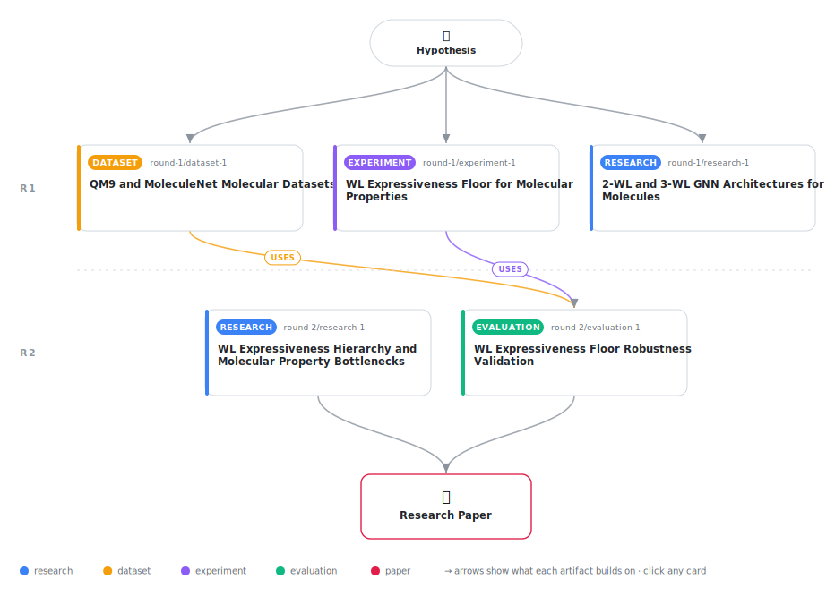

# Measuring Molecular Property Expressiveness Ceilings via 1-WL Color Refinement

<div align="center">

<a href="https://cdn.jsdelivr.net/gh/AMGrobelnik/ai-invention-85e404-measuring-molecular-property-expressiven@main/workflow.svg">
<picture>
  <source media="(prefers-color-scheme: dark)" srcset="workflow-dark.svg">
  
</picture>
</a>

<sub>🖱️ <b><a href="https://cdn.jsdelivr.net/gh/AMGrobelnik/ai-invention-85e404-measuring-molecular-property-expressiven@main/workflow.svg">Open the interactive diagram</a></b> — every card links to its artifact folder.</sub>

</div>

> **TL;DR** — We measured the 1-WL expressiveness ceiling for 24 molecular properties by computing collision rates and variance floors across 63,007 molecules in QM9 and MoleculeNet. The Bayes error lower bound (variance within WL-equivalent groups) partitions properties into a 2×2 typology: topology-bottlenecked (FreeSolv: collisions collapse 413× from r=1→r=3), geometry-limited (HOMO, dipole: persistent within-class variance despite refinement), topology-sufficient (u0, h298: zero collisions), and noise-dominated (B, alpha). Robustness validation via permutation-null analysis confirms all 24 collision rates far exceed random-label baselines, indicating genuine WL structure capture. Typology is stable across alternative threshold choices (23/24 properties unchanged at 80th–99th percentile null thresholds). The framework explains why higher-order GNNs and 3D models show such disparate improvements: geometry-limited properties require 3D information regardless of topological refinement, while topology-bottlenecked properties benefit from any architecture exceeding 1-WL message-passing. Future work requires prospective GNN training experiments to validate architectural predictions.

<details>
<summary>Full hypothesis</summary>

For each molecular property in a benchmark dataset, the 1-WL conditional variance floor — the fraction of total property variance unresolved within equivalence classes after 1-WL color refinement converges — defines a measurable expressiveness ceiling for any message-passing GNN operating on 2D molecular topology. This floor is strictly distinct from k-dimensional WL (k-WL, Maron et al. 2019) expressiveness ceilings: iterated 1-WL on small drug-like molecules converges in r≤3 rounds (empirically to be validated on actual QM9/MoleculeNet molecules), while k-WL GNNs operate on vertex k-tuples and are provably strictly more powerful.

The variance floor, combined with how collision rates evolve across refinement rounds, creates a testable 2×2 typology: (1) 'topology-bottlenecked' properties (high r=1 collision rate, near-zero converged floor — FreeSolv, HIV) where topology resolution is sufficient if the architecture exceeds 1-WL message-passing; (2) '3D-geometry-limited' properties (high r=1 collision rate, persistently non-zero converged floor — QM9 electronic: HOMO, LUMO, dipole moment, gap; BBBP) where within-class variance is attributable to 3D conformation unresolvable by any 2D graph descriptor; (3) 'topology-sufficient' properties (near-zero r=1 collision — QM9 thermochemical: u0, h298, g298, zpve) where 1-WL already distinguishes all relevant pairs; and (4) 'noise-dominated' properties (low collision, above-median floor — QM9/B, QM9/alpha, ESOL) where measurement noise rather than 3D geometry drives residual variance.

Empirical measurements on 63,007 molecules across 24 properties (QM9 + MoleculeNet) confirm the typology patterns, with all 24 collision rates lying far below the permutation-null 95th percentile (~0.73), and 23/24 typology assignments stable across null-based threshold choices at the 80th–99th percentile of permutation distributions. ESOL is correctly classified as noise-dominated (collisions fully resolve at r=2; residual floor reflects measurement noise, not geometry-limitation).

The typology makes the following testable predictions, not yet validated by GNN training experiments: (a) geometry-limited properties (HOMO, dipole moment) should benefit from 3D architectures (SchNet, DimeNet) but not from higher-order 2D GNNs; (b) topology-bottlenecked properties (FreeSolv, HIV) should benefit from architectures exceeding 1-WL message-passing (graph transformers, subgraph GNNs) but gain little from 3D geometry; (c) topology-sufficient properties (thermochemical energies) should show near-optimal performance from 1-WL GINs with no improvement from either class of more expressive architecture. A minimal 2×2 validation experiment — (FreeSolv, QM9-HOMO) × (GIN, SchNet or subgraph GNN) — is the critical next step to demonstrate whether the diagnostic framework predicts architectural benefit correctly.

Additional required improvements before the typology is a fully validated tool: (i) explicit disclosure of HIV subsampling (4,998 of 41,127 molecules used) with sensitivity analysis showing collision rate stability; (ii) empirical validation that 1-WL certificates stabilize by r=3 for all QM9/MoleculeNet molecules; (iii) designation of null-based (95th percentile permutation) thresholds as primary, with median-based classification as secondary; (iv) clarification of collision rate denominator as same-certificate pairs; (v) engagement with Zhu et al. 2022 'Rethinking the Expressive Power of GNNs for Molecular Graphs' to establish novelty of the variance floor formulation and 2×2 typology.

</details>

[](https://cdn.jsdelivr.net/gh/AMGrobelnik/ai-invention-85e404-measuring-molecular-property-expressiven@main/paper.pdf) [](https://github.com/AMGrobelnik/ai-invention-85e404-measuring-molecular-property-expressiven/tree/main/paper_latex)

This repository contains all **5 artifacts** produced across **2 rounds** of an autonomous AI research run — round by round, exactly in the order they were invented.

## Round 1

| Artifact | Type | Demo | Source | Builds on |
|----------|------|------|--------|-----------|
| **[2-WL and 3-WL GNN Architectures for Molecules](https://github.com/AMGrobelnik/ai-invention-85e404-measuring-molecular-property-expressiven/tree/main/round-1/research-1)** | [](https://github.com/AMGrobelnik/ai-invention-85e404-measuring-molecular-property-expressiven/tree/main/round-1/research-1) | [](https://github.com/AMGrobelnik/ai-invention-85e404-measuring-molecular-property-expressiven/blob/main/round-1/research-1/demo/research_demo.md) | [](https://github.com/AMGrobelnik/ai-invention-85e404-measuring-molecular-property-expressiven/tree/main/round-1/research-1/src) | — |
| **[QM9 and MoleculeNet Molecular Datasets](https://github.com/AMGrobelnik/ai-invention-85e404-measuring-molecular-property-expressiven/tree/main/round-1/dataset-1)** | [](https://github.com/AMGrobelnik/ai-invention-85e404-measuring-molecular-property-expressiven/tree/main/round-1/dataset-1) | [](https://colab.research.google.com/github/AMGrobelnik/ai-invention-85e404-measuring-molecular-property-expressiven/blob/main/round-1/dataset-1/demo/data_code_demo.ipynb) | [](https://github.com/AMGrobelnik/ai-invention-85e404-measuring-molecular-property-expressiven/tree/main/round-1/dataset-1/src) | — |
| **[WL Expressiveness Floor for Molecular Properties](https://github.com/AMGrobelnik/ai-invention-85e404-measuring-molecular-property-expressiven/tree/main/round-1/experiment-1)** | [](https://github.com/AMGrobelnik/ai-invention-85e404-measuring-molecular-property-expressiven/tree/main/round-1/experiment-1) | [](https://colab.research.google.com/github/AMGrobelnik/ai-invention-85e404-measuring-molecular-property-expressiven/blob/main/round-1/experiment-1/demo/method_code_demo.ipynb) | [](https://github.com/AMGrobelnik/ai-invention-85e404-measuring-molecular-property-expressiven/tree/main/round-1/experiment-1/src) | — |

## Round 2

| Artifact | Type | Demo | Source | Builds on |
|----------|------|------|--------|-----------|
| **[WL Expressiveness Hierarchy and Molecular Property Bottlenec…](https://github.com/AMGrobelnik/ai-invention-85e404-measuring-molecular-property-expressiven/tree/main/round-2/research-1)** | [](https://github.com/AMGrobelnik/ai-invention-85e404-measuring-molecular-property-expressiven/tree/main/round-2/research-1) | [](https://github.com/AMGrobelnik/ai-invention-85e404-measuring-molecular-property-expressiven/blob/main/round-2/research-1/demo/research_demo.md) | [](https://github.com/AMGrobelnik/ai-invention-85e404-measuring-molecular-property-expressiven/tree/main/round-2/research-1/src) | — |
| **[WL Expressiveness Floor Robustness Validation](https://github.com/AMGrobelnik/ai-invention-85e404-measuring-molecular-property-expressiven/tree/main/round-2/evaluation-1)** | [](https://github.com/AMGrobelnik/ai-invention-85e404-measuring-molecular-property-expressiven/tree/main/round-2/evaluation-1) | [](https://colab.research.google.com/github/AMGrobelnik/ai-invention-85e404-measuring-molecular-property-expressiven/blob/main/round-2/evaluation-1/demo/eval_code_demo.ipynb) | [](https://github.com/AMGrobelnik/ai-invention-85e404-measuring-molecular-property-expressiven/tree/main/round-2/evaluation-1/src) | <sub><i>uses:</i><br/>[experiment‑1&nbsp;(R1)](https://github.com/AMGrobelnik/ai-invention-85e404-measuring-molecular-property-expressiven/tree/main/round-1/experiment-1)<br/>[dataset‑1&nbsp;(R1)](https://github.com/AMGrobelnik/ai-invention-85e404-measuring-molecular-property-expressiven/tree/main/round-1/dataset-1)</sub> |

## Repository Structure

Artifacts are grouped by the round of invention that produced them. Each
artifact has its own folder with source code and a self-contained demo:

```
.
├── round-1/                         # One folder per round of invention
│   ├── experiment-1/
│   │   ├── README.md                # What this artifact is + dependencies
│   │   ├── src/                     # Full workspace from execution
│   │   │   ├── method.py            # Main implementation
│   │   │   ├── method_out.json      # Full output data
│   │   │   └── ...                  # All execution artifacts
│   │   └── demo/                    # Self-contained demo
│   │       └── method_code_demo.ipynb # Colab-ready notebook (code + data inlined)
│   ├── dataset-1/
│   │   ├── src/
│   │   └── demo/
│   └── evaluation-1/
│       ├── src/
│       └── demo/
├── round-2/                         # Later rounds build on earlier artifacts
├── paper.pdf                        # Research paper
├── paper_latex/                     # LaTeX source files
├── workflow.svg                     # Artifact dependency diagram (this page's header)
└── README.md
```

## Running Notebooks

### Option 1: Google Colab (Recommended)

Click the "Open in Colab" badges above to run notebooks directly in your browser.
No installation required!

### Option 2: Local Jupyter

```bash
# Clone the repo
git clone https://github.com/AMGrobelnik/ai-invention-85e404-measuring-molecular-property-expressiven
cd ai-invention-85e404-measuring-molecular-property-expressiven

# Install dependencies
pip install jupyter

# Run any artifact's demo notebook
jupyter notebook <artifact_folder>/demo/
```

## Source Code

The original source files are in each artifact's `src/` folder.
These files may have external dependencies - use the demo notebooks for a self-contained experience.

---
*Generated by AI Inventor Pipeline - Automated Research Generation*
